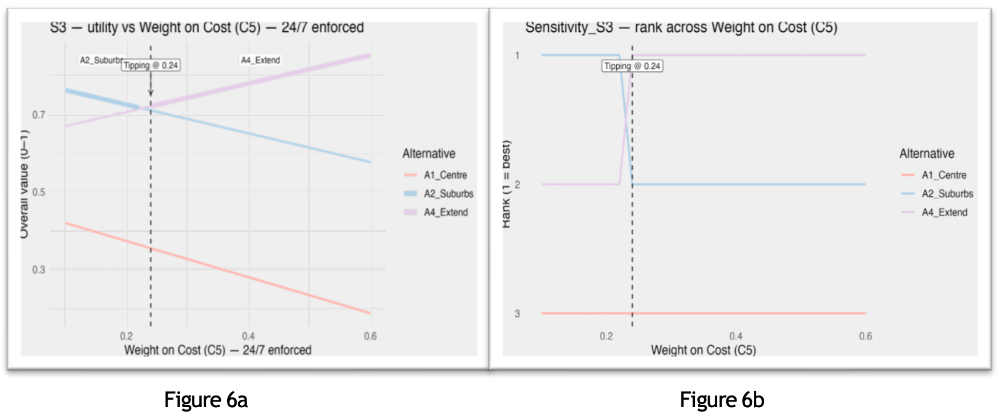

# Tesbury — Site Selection & Sales Drivers

Recruiter‑focused snapshot: multi‑criteria site decision (WSM/TOPSIS) + store‑level sales regression.

## Highlights
- **Decision models:** WSM & TOPSIS across 3 scenarios (+ sensitivity on cost weight / importance factor).
- **Sales modeling:** Per‑store OLS and an overall model; validation via Actual vs Predicted.
- **Ready visuals:** 11 figures in `/images` with descriptive filenames.

## Repo Layout
```
data/       # Sales.csv (input)
scripts/    # part1_tesbury_site_selection.R, part2_sales_regression.R
images/     # wsm_*, topsis_*, sensitivity_*, actual_vs_predicted_*, store_coefficients_*
docs/       # one_pager.md (source) + one_pager.pdf (shareable)
```
## Reproduce (R)
```r
# Run analyses (adapt file paths if needed)
source('scripts/part1_tesbury_site_selection.R')
source('scripts/part2_sales_regression.R')
```
## Figures (quick view)

**Model fit**  


**Store drivers**  


**WSM scenarios**  
  
  


**TOPSIS**  


**Sensitivity (utility margin + rank)**  
  
  
  
  
  


License: MIT (see LICENSE).
